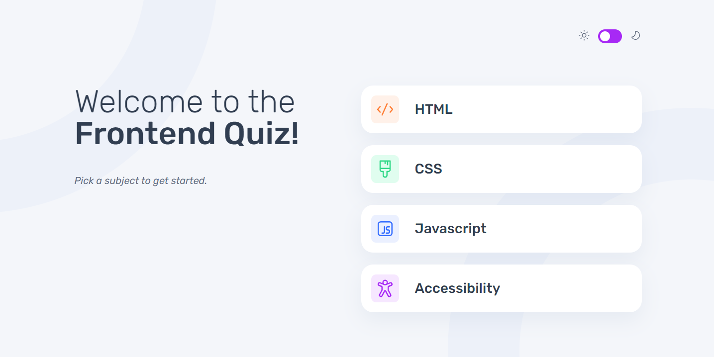
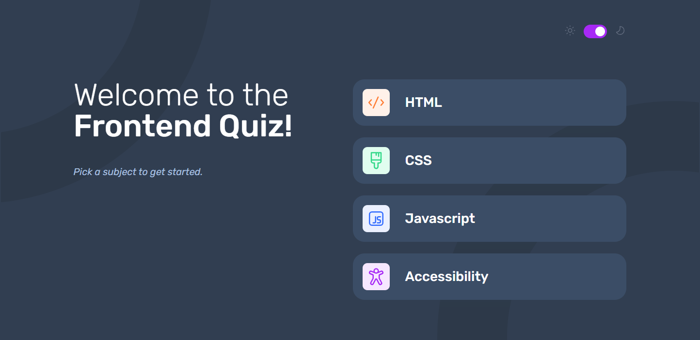
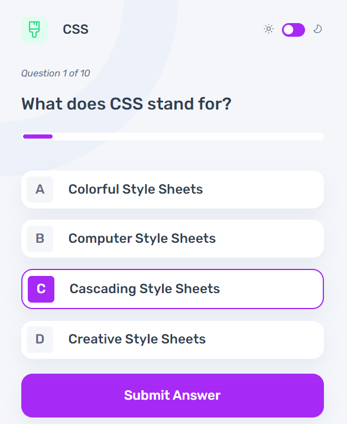
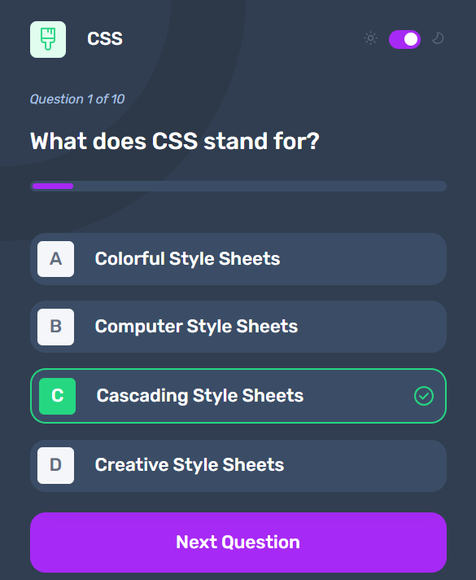
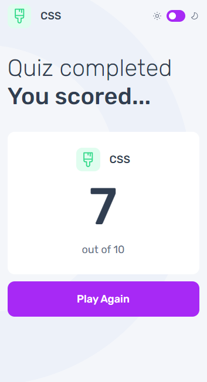
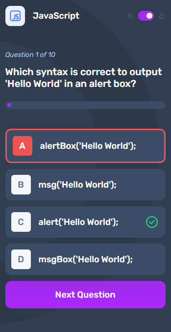

# Frontend Quiz App Challenge from Frontend Mentor

## App built using Typescript, React & Vite

# Live Demo
Click [here](https://frontend-quiz-sabina.netlify.app/) to see the live demo of the Frontend Quiz.

# Brief
Users should be able to:
- Select a quiz subject
- Select a single answer from each question from a choice of four
- See an error message when trying to submit an answer without making a selection
- See if they have made a correct or incorrect choice when they submit an answer
- Move on to the next question after seeing the question result
- See a completed state with the score after the final question
- Play again to choose another subject
- View the optimal layout for the interface depending on their device's screen size
- See hover and focus states for all interactive elements on the page
- Navigate the entire app only using their keyboard
- Change the app's theme between light and dark

# Technologies Used
- TypeScript
- React
- Vite
- Context API
- CSS modules

# License
This project is licensed under [Frontend Mentor](https://www.frontendmentor.io/).

# Contact
For any questions or inquiries, please feel free to reach out to me at sabinacristea997@gmail.com.
